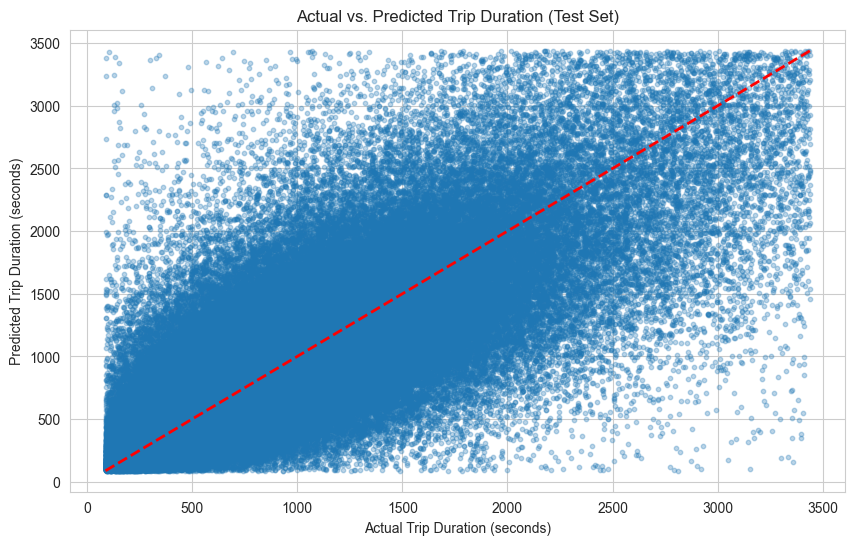

# NYC Taxi Trip Duration Prediction

This project uses Scikit-learn's Decision Tree Regression to predict taxi trip durations in New York City using the [NYC Taxi Trip Duration Dataset](https://www.kaggle.com/c/nyc-taxi-trip-duration). The project demonstrates advanced machine learning techniques, including feature engineering, hyperparameter tuning, and model interpretability.

## Project Overview
- **Dataset**: NYC Taxi Trip Duration (~1.4M trips, 10+ features).
- **Target**: Predict `trip_duration` (seconds).
- **Features**: Engineered features like trip distance, rush hour indicators, and polynomial interactions.
- **Techniques**:
  - Preprocessing: Outlier removal, categorical encoding.
  - Feature Engineering: Haversine distance, time-based features, polynomial features.
  - Model: Decision Tree Regression with GridSearchCV tuning.
  - Evaluation: R² (0.7510 on test set), RMSE (286.51 seconds on test set).
- **Visualizations**: Feature importance, actual vs. predicted values, decision tree structure.

## Results
- **Model Performance**:
  - Testing R²: 0.7510 (explains ~75% of variance).
  - Testing RMSE: 286.51 seconds (~4.8 minutes average error).
- **Key Features**: Trip distance (`distance_km`) dominates predictions, followed by pickup hour and spatial coordinates.

## Visualizations

## Setup
1. Clone the repository: `git clone https://github.com/GoudyMT/nyc-taxi-trip-duration.git`
2. Create a virtual environment: `python -m venv venv`
3. Activate the virtual environment:
   - Windows: `venv\Scripts\activate`
   - macOS/Linux: `source venv/bin/activate`
4. Install dependencies: `pip install -r requirements.txt`
5. Download the dataset from [Kaggle](https://www.kaggle.com/c/nyc-taxi-trip-duration) and place `train.csv` in the project directory.
6. Run the Jupyter Notebook: `jupyter notebook`

## License
This project is licensed under the MIT License - see the [LICENSE](LICENSE) file for details.